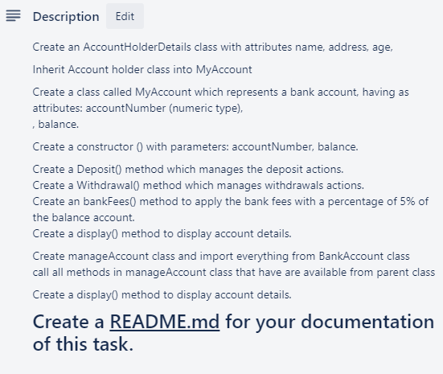

# TASK 6



**Documentation**

- The AccountHolderDetails class stores simple info about a person: name, age and 
address

- The MyAccount class stores all needed information about their bank account: account number, balance, bank fees
    - When an object of this class is initialised, I use a private method to create a random 8-digit account number and assign it as a private variable
    - The method is private so it can't be called again once it's done
    - There are methods that allow one to display info, withdraw, deposit and return the current bank fees
    - Bank fees apply when withdrawing money but I don't inform the user to be realistic (banks want more money)

- The ManageAccount class makes up the menu for the choices a user can make to manage their bank account
    - There are four options to choose from
    - There are separate functions for each choice, allowing the main function ```options()``` to be more readable

- Finally, I initialise the entire program by adding a user with a balance of £1000 to test the functionality of the entire script

**Possible increments**
- Add the possibility of other bank accounts
- When trying to enter 'Manage Bank Account' the program could ask for a PIN to verify
- Add different types of bank accounts, which allows different bank fees to apply to different accounts
    - We could utilise this via an account id key with different bank fees according to the id

**Things to keep in mind**
- The program acts like an ATM machine, not a mobile banking app that can manage everything
- Most of the time, customers will have to call up a bank or go in person to change personal details, which is why I didn't include any ways to do that personally
- Really, this only left me with very basic managing functions so I decided to make it like an ATM